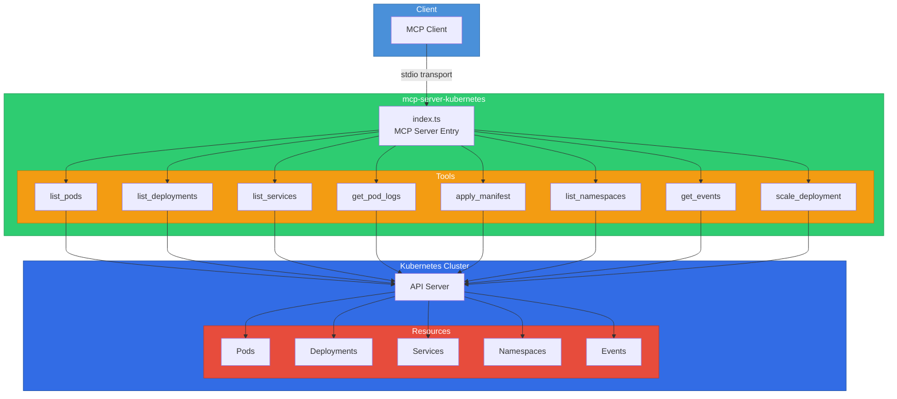

# mcp-server-kubernetes

An MCP (Model Context Protocol) server that provides tools for interacting with Kubernetes clusters, including pods, deployments, services, namespaces, events, and manifest management.

## Architecture



## Installation

```bash
npm install
npm run build
```

## Configuration

The server uses the default kubeconfig file (`~/.kube/config`) or in-cluster configuration when running inside Kubernetes.

| Variable | Description | Required |
|---|---|---|
| `KUBECONFIG` | Path to kubeconfig file | No (defaults to `~/.kube/config`) |

## Usage

### Standalone

```bash
npm start
```

### Development

```bash
npm run dev
```

### Docker

```bash
docker build -t mcp-server-kubernetes .
docker run -v ~/.kube/config:/root/.kube/config:ro mcp-server-kubernetes
```

### MCP Client Configuration

```json
{
  "mcpServers": {
    "kubernetes": {
      "command": "node",
      "args": ["dist/index.js"],
      "env": {
        "KUBECONFIG": "/path/to/kubeconfig"
      }
    }
  }
}
```

## Tool Reference

| Tool | Description | Parameters |
|---|---|---|
| `list_pods` | List pods | `namespace?`, `label_selector?` |
| `list_deployments` | List deployments | `namespace?` |
| `list_services` | List services | `namespace?` |
| `get_pod_logs` | Get pod logs | `namespace`, `pod_name`, `container?`, `tail_lines?` |
| `apply_manifest` | Apply a K8s manifest | `manifest` (YAML string) |
| `list_namespaces` | List namespaces | none |
| `get_events` | Get cluster events | `namespace?` |
| `scale_deployment` | Scale a deployment | `namespace`, `deployment_name`, `replicas` |

## License

MIT
